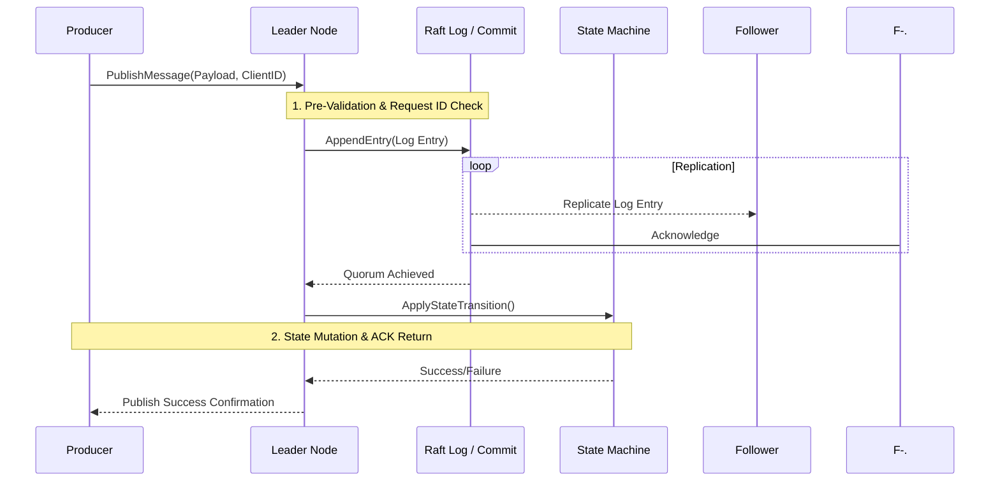

# Clustered Exactly-Once Queue: A Distributed Systems Experiment

This repository is an experimental project for designing and implementing a robust, distributed clustered queue that guarantees **exactly-once delivery semantics**, supports horizontal scalability, self-healing capabilities, and full observability.

It serves as a comprehensive testbed developed with the assistance of advanced AI tools and pi.dev, aiming to explore how modern AI workflows can support the design, implementation, testing, debugging, and analysis of complex distributed systems.

> ⚠️ **Project Status:** Experimental / Educational Thesis.
> The system is designed to demonstrate deep knowledge rather than claim production-grade reliability until rigorous failure testing proves its invariants.

## 🎯 Project Goals & Core Challenge
The primary objective is the reliable implementation of a clustered message queue that solves the fundamental distributed systems problem: guaranteeing **exactly-once processing** across multiple nodes and services, even under severe network and component failures.

### The Core Problem: Semantic Guarantees
We are designing a system where Producers submit messages to the cluster, and Consumers reliably receive them. The core challenge lies in guaranteeing that the side effect of message processing occurs exactly once.

*   **Semantic Scope:** The project must rigorously define the boundary of its guarantee. Does "exactly-once" apply only to the queue's internal state transitions (e.g., commit log)? Or does it extend to external consumer side effects?
    *   We aim to provide **guaranteed message delivery attempt semantics**, while explicitly identifying and mitigating the necessary components (like idempotency keys or transactional outboxes) required for true end-to-end exactly-once processing at the Consumer layer.

## 🏛️ Architecture Overview (Diagrams)
To understand the system boundaries, please review these diagrams:

### 1. Context Diagram - System Boundaries
This diagram shows how our queue fits into a larger ecosystem of external services and actors.

```mermaid
graph LR
    A[Producer Services] -->|gRPC Messages| C(Queue Cluster);
    D[Consumer Services] <--|gRPC Pull/Push| C;
    E[External Data Stores] <-->|Persistence Access| D;
    F[Monitoring System (Prometheus/Grafana)] -->|Metrics Read| C;
```

### 2. Component Diagram - Internal Structure
This illustrates the internal components of a single queue node and how they interact to maintain consistency.

```mermaid
graph LR
    subgraph Queue Cluster Node
        A[API Gateway / gRPC] --> B(Raft Consensus Engine);
        B --> C{State Machine};
        C --> D[(Durable State Storage)];
        C --> E[Message Index / Metadata];
        E --> F[Metrics Collector];
    end

    subgraph Raft Group (Leader/Followers)
        B -- Replication Log --> B;
    end
```

### 3. Sequence Diagram - Message Publish Flow
This illustrates the critical path of publishing a message, highlighting how Raft ensures durability and consensus before success is reported.



## ✨ Technical Deep Dive and Design Principles

### Guarantees and Invariants (Research Focus)
The system must uphold the following verifiable invariants:
1.  **Global Uniqueness:** Every message receives a universally unique ID, regardless of client retries or node restarts.
2.  **Consistency Boundary:** All state transitions must pass through the Raft log and be committed by a quorum. **This is the single source of truth.**
3.  **Idempotency Enforcement:** The system must detect and discard duplicate requests (e.g., using client-provided request IDs) to prevent redundant operations from corrupting state.

### Architectural Trade-offs (Design Consideration)
The initial design choice leans towards **strong consistency over raw throughput**. By adopting Raft, we ensure that all nodes agree on the message sequence, sacrificing potential write speed gains available in eventual consistency models (like gossip protocols). Future work will analyze scaling out to multiple, independently sharded Raft groups to improve horizontal scalability.

### Failure Model Assumption (Theoretical Foundation)
The system assumes a **Crash-Fail-Stop (CFS)** failure model for nodes and network links. This means:
*   Nodes either function correctly or they stop completely. They do not fail by sending corrupted, ambiguous, or malicious data (i.e., Byzantine faults are out of scope).
*   Network partitions are possible but always recover to a consistent state eventually.

## 🛠️ Development Process and Methodology
This project is also an experiment in **AI-Assisted Software Engineering**. Our methodology involves:
1.  **Hypothesis Generation:** Using AI (e.g., drafting the initial architecture).
2.  **Critical Review & Constraint Definition:** Human experts defining invariants, failure boundaries, and non-functional requirements.
3.  **Implementation & Testing:** Writing Go code backed by comprehensive Integration/Failure tests.
4.  **AI Feedback Loop:** Using AI to assist in generating unit test cases based on failure scenarios (e.g., "Generate a test for leader failover during log application").

> **Key Principle:** All AI-generated components must be treated as hypotheses and validated against explicit invariants, concurrency rules, and formal testing.

## 📚 Scope Definition
### ✅ Core Capabilities (Goals)
*   Implementing the core messaging API (Publish, Consume, Acknowledge).
*   Ensuring Raft-based consensus for all critical state changes.
*   Providing robust failure recovery mechanisms (node restart, leader election).
*   Exposing comprehensive metrics and tracing endpoints.

### 🛑 Non-Goals & Out of Scope (Limitations)
The current scope intentionally excludes:
*   **Multi-Region/Geo-Replication:** Initial deployment is single-datacenter focused.
*   **Advanced Security:** Authorization policies beyond basic API key validation are out of scope.
*   **Performance Benchmarking vs. Industry Leaders:** Direct, comparative benchmarking against Kafka or Pulsar is a future goal and not part of the initial functional specification.

## ⚙️ Technical Components & Implementation Details
### Technology Stack
*   **Language:** Go (Concurrency via Goroutines/Channels).
*   **RPC Framework:** gRPC.
*   **Consensus:** Raft Consensus Algorithm implementation.
*   **Persistence:** Structured durable storage for logs and state snapshots.

### Concurrency Safety
The design must address concurrency as a primary concern, utilizing Go primitives (Mutexes, Channels) to manage concurrent operations such as multiple producers, parallel consumer groups, and the inherent complexity of Raft's internal state transitions. Testing must include the use of the `go race detector`.

## 📂 Project Structure
(The folder structure remains modular to facilitate independent development of concerns.)
```text
├── cmd/          # Entry points for client/server execution
├── internal/     # Core business logic (raft, queue, storage)
├── proto/        # Protocol buffers definitions (gRPC schemas)
└── tests/         # Comprehensive test suites (unit, integration, failure)
```

## 🧑‍💻 Contribution Guide
We encourage contributions that improve the system's robustness or deepen its theoretical understanding. Contributions should be accompanied by:
1.  A clear definition of the feature or fix being implemented.
2.  Updated documentation on invariants or trade-offs.
3.  New, failing test cases demonstrating failure modes (Chaos Engineering).